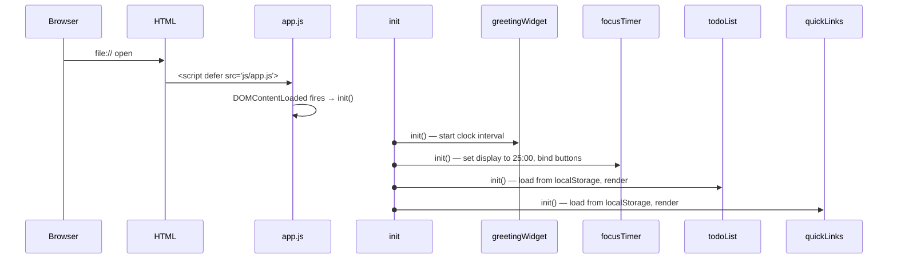
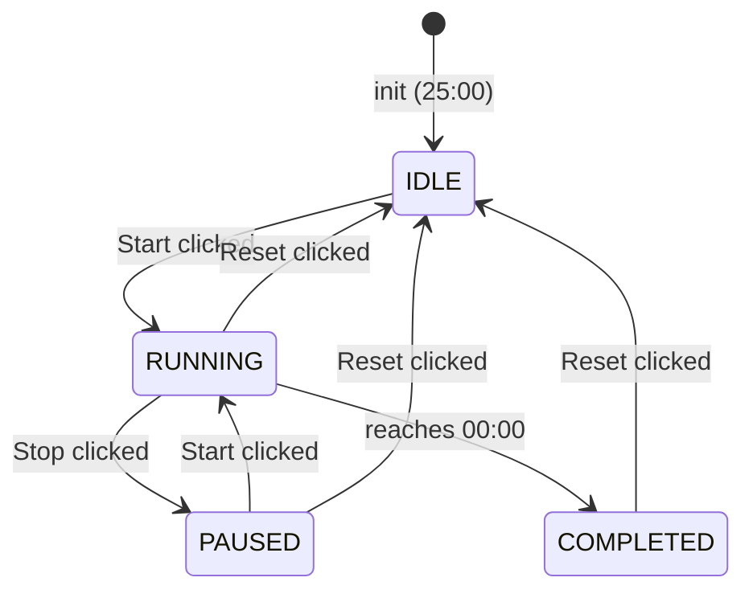

# Design Document: To-Do List Life Dashboard

## Overview

The To-Do List Life Dashboard is a single-page client-side application delivered as three plain files: one HTML, one CSS, one JS. There is no framework, no bundler, and no runtime dependency on the network. All state is held in memory during the session and serialised to `localStorage` on every mutation.

The application is composed of four independent widgets arranged on a responsive grid:

| Widget | Primary Responsibility |
|---|---|
| Greeting Widget | Live clock, date display, and time-based greeting |
| Focus Timer | 25-minute countdown with Start / Stop / Reset |
| To-Do List | Task CRUD with per-task completion toggle |
| Quick Links | URL shortcut buttons with label/URL add form |

Each widget owns its own slice of the DOM, its own state object, and its own `localStorage` key. Widgets do not communicate with each other; the only shared infrastructure is the storage helper and the initialisation entry point.

---

## Architecture

### File Structure

```
project-root/
├── index.html          ← single HTML entry point
├── css/
│   └── style.css       ← all visual styles; zero inline styles in HTML
└── js/
    └── app.js          ← all application logic
```

### Module Organisation Inside `app.js`

Because the project must not use ES modules (import/export) — to keep `file://` compatibility without a server or CORS workaround — the entire JS file is wrapped in an IIFE. Internal organisation uses the **Revealing-Module pattern** via plain object literals.

```
app.js (IIFE wrapper)
├── utils/
│   ├── storage         — localStorage read/write/remove helpers
│   └── domHelpers      — querySelector shortcuts, element creation
├── modules/
│   ├── greetingWidget  — clock, date, greeting logic
│   ├── focusTimer      — countdown state machine, interval management
│   ├── todoList        — task CRUD, render, persistence
│   └── quickLinks      — link CRUD, render, persistence
└── init()              — called on DOMContentLoaded; boots all modules
```

### Initialisation Sequence



No widget depends on another widget's initialisation completing; all four run sequentially but independently.

### Clock Update Strategy

The Greeting Widget runs `setInterval(tick, 1000)`. Each tick:
1. Reads `new Date()`.
2. Updates only the `#clock`, `#date`, and `#greeting` text nodes.
3. Does not touch any other widget's DOM subtree, preventing layout reflow in unrelated areas.

---

## Components and Interfaces

### 1. Greeting Widget

**DOM Structure**

```html
<section id="greeting-widget" aria-label="Greeting">
  <p id="greeting-text">Good Morning</p>
  <p id="clock">00:00:00</p>
  <p id="date-text">Monday, 28 July 2025</p>
</section>
```

**Public interface (greetingWidget object)**

| Method | Description |
|---|---|
| `init()` | Performs first render, starts 1-second interval |
| `tick()` | Called by interval; reads clock, updates DOM |
| `getGreeting(hour)` | Pure function: maps 0–23 → greeting string |
| `formatTime(date)` | Pure function: returns `"HH:MM:SS"` string |
| `formatDate(date)` | Pure function: returns full date string |

**Greeting rules (implemented as a lookup)**

| Hour range | Message |
|---|---|
| 05 – 11 | "Good Morning" |
| 12 – 17 | "Good Afternoon" |
| 18 – 21 | "Good Evening" |
| 22 – 23, 00 – 04 | "Good Night" |

**Error handling**: wrapped in `try/catch`; on failure sets `#clock` to `"Time unavailable"` and hides `#greeting-text`.

---

### 2. Focus Timer

**State Machine**



**State variables (all local to focusTimer module)**

| Variable | Type | Description |
|---|---|---|
| `remainingSeconds` | number | Seconds left; initialised to 1500 |
| `state` | enum string | `"idle"` \| `"running"` \| `"paused"` \| `"completed"` |
| `intervalId` | number \| null | Return value of `setInterval`; `null` when not running |

**DOM Structure**

```html
<section id="focus-timer" aria-label="Focus Timer">
  <p id="timer-display">25:00</p>
  <div class="timer-controls">
    <button id="timer-start">Start</button>
    <button id="timer-stop">Stop</button>
    <button id="timer-reset">Reset</button>
  </div>
</section>
```

**Public interface (focusTimer object)**

| Method | Description |
|---|---|
| `init()` | Renders 25:00, binds button click handlers |
| `start()` | Transitions IDLE/PAUSED → RUNNING; starts interval |
| `stop()` | Transitions RUNNING → PAUSED; clears interval |
| `reset()` | Any state → IDLE; clears interval, resets to 1500s |
| `tick()` | Called by interval; decrements, updates display, checks completion |
| `render()` | Formats `remainingSeconds` → `MM:SS`, writes to `#timer-display` |
| `setCompleted()` | Adds CSS class `timer--completed` to `#focus-timer` |

**Guard conditions** — `start()` is a no-op when `state === "running"`; `stop()` is a no-op when `state !== "running"`.

---

### 3. To-Do List

**DOM Structure**

```html
<section id="todo-list" aria-label="To-Do List">
  <div class="todo-input-row">
    <input id="todo-input" type="text" maxlength="200" placeholder="New task…" />
    <button id="todo-add">Add</button>
  </div>
  <ul id="task-list">
    <!-- <li> items rendered by JS -->
  </ul>
  <p id="todo-empty" hidden>No tasks yet. Add one above.</p>
</section>
```

**Per-task list item template (rendered by JS)**

```html
<li class="task-item [task-item--complete]" data-id="<uuid>">
  <button class="task-toggle" aria-label="Toggle complete" aria-pressed="false">✓</button>
  <span class="task-text">Task description here</span>
  <!-- OR in edit mode: -->
  <input class="task-edit-input" type="text" maxlength="500" value="Task description here" />
  <button class="task-edit">Edit</button>
  <button class="task-delete">Delete</button>
</li>
```

**Public interface (todoList object)**

| Method | Description |
|---|---|
| `init()` | Loads from storage, renders, binds input events |
| `addTask(description)` | Validates, creates Task, saves, re-renders |
| `deleteTask(id)` | Removes Task by id, saves, re-renders |
| `toggleTask(id)` | Flips `completed`, saves, re-renders |
| `beginEdit(id)` | Swaps span for input in that `<li>` |
| `saveEdit(id, newText)` | Validates, updates, saves, exits edit mode |
| `cancelEdit(id)` | Restores original text, exits edit mode |
| `render()` | Full re-render of `<ul>` from in-memory array |
| `save()` | Writes task array to localStorage |
| `load()` | Reads and parses from localStorage |

**Edit mode constraint**: `todoList` tracks `editingId` (string or null). `beginEdit` calls `saveEdit`/`cancelEdit` on any previously editing item before opening the new one.

---

### 4. Quick Links

**DOM Structure**

```html
<section id="quick-links" aria-label="Quick Links">
  <div class="links-input-row">
    <input id="link-label" type="text" maxlength="100" placeholder="Label" />
    <input id="link-url"   type="url"  maxlength="2048" placeholder="https://…" />
    <button id="link-add">Add</button>
  </div>
  <p id="link-error" hidden></p>
  <div id="links-grid">
    <!-- <div class="link-item"> elements rendered by JS -->
  </div>
  <p id="links-empty" hidden>No quick links yet. Add one above.</p>
</section>
```

**Per-link template (rendered by JS)**

```html
<div class="link-item">
  <a href="<url>" target="_blank" rel="noopener noreferrer" class="link-btn">
    <span class="link-label">Label (truncated to 50 chars)</span>
  </a>
  <button class="link-delete" aria-label="Delete link">×</button>
</div>
```

**Public interface (quickLinks object)**

| Method | Description |
|---|---|
| `init()` | Loads from storage, renders, binds input events |
| `addLink(label, url)` | Validates label/URL, creates Link, saves, re-renders |
| `deleteLink(id)` | Removes Link by id, saves, re-renders |
| `render()` | Full re-render of `#links-grid` from in-memory array |
| `save()` | Writes link array to localStorage |
| `load()` | Reads and parses from localStorage |
| `validateUrl(url)` | Returns bool: starts with `http://` or `https://` |

---

## Data Models

All data is stored in `localStorage` as JSON strings. No server-side schema or migration mechanism is needed.

### Task Object

```js
{
  id: string,          // crypto.randomUUID() or Date.now().toString() fallback
  description: string, // 1–500 characters (trimmed before storage)
  completed: boolean,  // false = incomplete, true = complete
  createdAt: number    // Unix timestamp ms (Date.now())
}
```

**Storage key**: `"todo_tasks"`  
**Storage format**: JSON array of Task objects  
**Example**:
```json
[
  { "id": "a1b2c3", "description": "Buy groceries", "completed": false, "createdAt": 1722124800000 },
  { "id": "d4e5f6", "description": "Read chapter 3", "completed": true,  "createdAt": 1722125000000 }
]
```

### Link Object

```js
{
  id: string,    // crypto.randomUUID() or Date.now().toString() fallback
  label: string, // 1–100 characters
  url: string    // 1–2048 characters; must start with http:// or https://
}
```

**Storage key**: `"quickLinks"`  
**Storage format**: JSON array of Link objects  
**Example**:
```json
[
  { "id": "x1y2z3", "label": "GitHub", "url": "https://github.com" },
  { "id": "w4v5u6", "label": "MDN Docs", "url": "https://developer.mozilla.org" }
]
```

### Storage Helper (`storage` object)

```js
storage = {
  get(key)       // → parsed array or [] on failure
  set(key, data) // → void; writes JSON.stringify(data)
  remove(key)    // → void
}
```

`get` wraps `JSON.parse` in `try/catch`; on error it logs a `console.warn` and returns `[]`. This satisfies the corruption-tolerance requirements for both `todo_tasks` and `quickLinks`.

---

## Correctness Properties

*A property is a characteristic or behavior that should hold true across all valid executions of a system — essentially, a formal statement about what the system should do. Properties serve as the bridge between human-readable specifications and machine-verifiable correctness guarantees.*

### Property 1: Greeting classification covers all hours

*For any* integer hour value in [0, 23], `greetingWidget.getGreeting(hour)` SHALL return exactly one of "Good Morning", "Good Afternoon", "Good Evening", or "Good Night", and the result SHALL be non-empty.

**Validates: Requirements 2.3, 2.4, 2.5, 2.6**

---

### Property 2: Clock format is always HH:MM:SS

*For any* valid `Date` object, `greetingWidget.formatTime(date)` SHALL return a string matching the pattern `^\d{2}:\d{2}:\d{2}$` with all components zero-padded.

**Validates: Requirements 2.1**

---

### Property 3: Whitespace-only task descriptions are rejected

*For any* string composed entirely of whitespace characters (space, tab, newline, etc.), `todoList.addTask(str)` SHALL not increase the length of the task array and the in-memory list SHALL remain unchanged.

**Validates: Requirements 4.3**

---

### Property 4: Task add/load round trip

*For any* valid (non-whitespace) task description, after calling `todoList.addTask(description)` and then simulating a fresh load via `todoList.load()`, the resulting task array SHALL contain an entry whose `description` equals the trimmed input value.

**Validates: Requirements 7.1, 7.2, 7.5**

---

### Property 5: Task toggle is a true inverse

*For any* task in the list, calling `todoList.toggleTask(id)` twice SHALL leave the task's `completed` state equal to its original value (round-trip idempotence).

**Validates: Requirements 6.1, 6.2**

---

### Property 6: Deleted task is absent after delete

*For any* task present in the list, after `todoList.deleteTask(id)`, no entry in the in-memory array SHALL have the same `id`.

**Validates: Requirements 6.3**

---

### Property 7: Edit save trims and enforces length

*For any* description string of 1–500 non-whitespace characters (after trim), `todoList.saveEdit(id, str)` SHALL store the trimmed value exactly and the stored description length SHALL be ≤ 500.

**Validates: Requirements 5.2, 5.5**

---

### Property 8: Quick Links add/load round trip

*For any* valid label (1–100 chars) and valid URL (starts with `http://` or `https://`, ≤ 2048 chars), after calling `quickLinks.addLink(label, url)` and then calling `quickLinks.load()`, the resulting link array SHALL contain an entry with the matching label and url.

**Validates: Requirements 10.1, 10.3, 10.5**

---

### Property 9: Invalid URL protocol is always rejected

*For any* URL string that does not begin with `http://` or `https://`, `quickLinks.validateUrl(url)` SHALL return `false` and `quickLinks.addLink(label, url)` SHALL not add an entry to the link array.

**Validates: Requirements 9.4**

---

### Property 10: Timer countdown decrements one second per tick

*For any* starting value of `remainingSeconds` in [1, 1500], after one call to `focusTimer.tick()`, the new `remainingSeconds` SHALL equal the previous value minus 1.

**Validates: Requirements 3.3**

---

### Property 11: Timer reset always returns to 1500 seconds

*For any* timer state (idle, running, paused, completed) and any value of `remainingSeconds`, after `focusTimer.reset()`, `remainingSeconds` SHALL equal 1500 and `state` SHALL equal `"idle"`.

**Validates: Requirements 3.5, 3.9**

---

### Property 12: Storage get/set round trip

*For any* JSON-serialisable array, writing it with `storage.set(key, data)` and immediately reading it back with `storage.get(key)` SHALL return a value deeply equal to the original array.

**Validates: Requirements 7.1, 7.2, 10.1, 10.3**

---

## Error Handling

| Scenario | Behaviour |
|---|---|
| `localStorage` not available (private browsing, storage full) | `storage.set` wraps in `try/catch`; logs `console.error`; app continues in-memory only |
| `localStorage` data corrupted on load | `storage.get` returns `[]`; widget renders empty state; `console.warn` logged |
| `new Date()` fails or returns `Invalid Date` | `greetingWidget.tick` catches the error; displays `"Time unavailable"` in `#clock`; hides greeting |
| User pastes more than max chars | `maxlength` HTML attribute prevents acceptance at browser level; JS validation provides secondary check |
| `crypto.randomUUID()` not available (very old browser) | Falls back to `Date.now().toString() + Math.random()` for id generation |
| Page load takes > 5 seconds | A `setTimeout(5000)` in `init()` checks if render completed; if not, inserts a global error banner and preserves existing `localStorage` data |
| Edit save with empty text after trim | Task description is unchanged; `task-item--error` CSS class is applied for visual indication; edit mode closes |
| Link add with empty label or empty URL | `#link-error` is shown with field-specific message; no entry created |
| Link add with invalid URL protocol | `#link-error` is shown with protocol error message; no entry created |

---

## Testing Strategy

### Dual Approach

The project uses both **example-based unit tests** and **property-based tests** to achieve comprehensive coverage.

- **Unit tests** handle specific scenarios, integration between functions, and edge cases.
- **Property tests** verify universal invariants that hold across all valid inputs.

### Property-Based Testing

**Library**: [fast-check](https://github.com/dubzzz/fast-check) (JavaScript PBT library, no build tool required when loaded via CDN in a test HTML harness, or via Node.js + a test runner such as Vitest for offline testing)

Each property in the Correctness Properties section is implemented as a single `fc.assert(fc.property(...))` test. Minimum 100 iterations per property (fast-check default is 100; explicitly configured via `numRuns: 100`).

**Tag format (comment in test file)**:
```
// Feature: todo-life-dashboard, Property N: <property text>
```

**Properties to implement as PBT**:

| Property | Generator inputs |
|---|---|
| 1 — Greeting covers all hours | `fc.integer({ min: 0, max: 23 })` |
| 2 — Clock format is HH:MM:SS | `fc.date()` |
| 3 — Whitespace tasks rejected | `fc.stringOf(fc.constantFrom(' ', '\t', '\n', '\r'))` |
| 4 — Task add/load round trip | `fc.string({ minLength: 1, maxLength: 500 }).filter(s => s.trim().length > 0)` |
| 5 — Toggle is inverse | task array + random `id` from that array |
| 6 — Delete removes task | task array + random `id` from that array |
| 7 — Edit trims and enforces length | `fc.string({ minLength: 1, maxLength: 500 }).filter(s => s.trim().length > 0)` |
| 8 — Link add/load round trip | `fc.string(1,100)` × valid URL generator |
| 9 — Invalid URL rejected | strings not starting with `http://` or `https://` |
| 10 — Timer ticks one second | `fc.integer({ min: 1, max: 1500 })` |
| 11 — Reset returns to 1500 | any timer state + any `remainingSeconds` |
| 12 — Storage round trip | `fc.array(fc.anything())` |

### Unit Tests (Example-Based)

Specific examples and integration scenarios not covered by properties:

- Greeting widget renders correct greeting on DOM init
- Focus timer displays `00:00` and shows `timer--completed` class when tick reaches zero
- Focus timer ignores Start when already running (requirement 3.7)
- Focus timer is a no-op on Stop when paused (requirement 3.8)
- Todo edit mode: only one task in edit mode at a time (requirement 5.6)
- Todo empty state message appears when zero tasks remain (requirement 4.5, 6.4)
- Quick links label truncation at 50 characters with ellipsis (requirement 8.1)
- Quick links open in new tab with `target="_blank"` and `rel="noopener noreferrer"` (requirement 8.2)
- Corrupted localStorage: widget loads with empty state and logs a warning (requirement 7.4)
- Dashboard renders all four widgets within 2 seconds (requirement 12.1)
- All controls reflect state update within 100ms of user input (requirement 12.2)

### Responsiveness Testing

Manual or automated viewport tests at: 320px, 375px, 768px, 1024px, 1440px, 1920px.

- Below 768px: single-column layout, no horizontal scrollbar
- 768px and above: multi-column grid layout

### Accessibility Testing

- All interactive elements have `aria-label` or visible text label
- `aria-pressed` on toggle buttons
- Colour contrast verified manually against WCAG 2.1 AA (4.5:1 for normal text)
- Keyboard navigation: Tab order follows visual order; all actions reachable via keyboard

> Note: Full WCAG 2.1 AA validation requires manual testing with assistive technologies and expert accessibility review.
